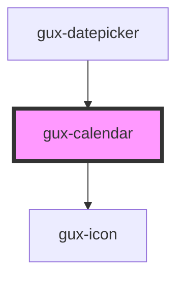

# genesys-calendar

This is a simple calendar component, that allows the user to select a date.

<!-- Auto Generated Below -->

## Properties

| Property         | Attribute           | Description                                | Type                                          | Default                |
| ---------------- | ------------------- | ------------------------------------------ | --------------------------------------------- | ---------------------- |
| `firstDayOfWeek` | `first-day-of-week` | The calendar first week day                | `number`                                      | `undefined`            |
| `maxDate`        | `max-date`          | The max date selectable                    | `string`                                      | `''`                   |
| `minDate`        | `min-date`          | The min date selectable                    | `string`                                      | `''`                   |
| `mode`           | `mode`              | The calendar mode (can be single or range) | `CalendarModes.Range \| CalendarModes.Single` | `CalendarModes.Single` |
| `numberOfMonths` | `number-of-months`  | The calendar number of months displayed    | `number`                                      | `1`                    |
| `value`          | `value`             | The calendar current selected date         | `string`                                      | `''`                   |

## Events

| Event   | Description                        | Type                  |
| ------- | ---------------------------------- | --------------------- |
| `input` | Triggered when user selects a date | `CustomEvent<string>` |

## Methods

### `focusPreviewDate() => Promise<void>`

Focus the preview date

#### Returns

Type: `Promise<void>`

### `setValue(value: Date | [Date, Date]) => Promise<void>`

Sets new value and rerender the calendar

#### Returns

Type: `Promise<void>`

## Dependencies

### Used by

 - [gux-datepicker](../gux-datepicker)

### Depends on

- [gux-icon](../gux-icon)

### Graph

----------------------------------------------

*Built with [StencilJS](https://stenciljs.com/)*
