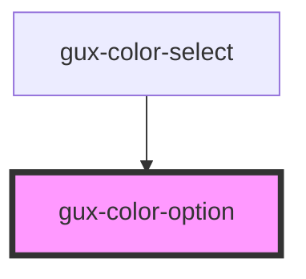

# gux-color-option

<!-- Auto Generated Below -->

## Properties

| Property | Attribute | Description                                                                      | Type      | Default     |
| -------- | --------- | -------------------------------------------------------------------------------- | --------- | ----------- |
| `active` | `active`  | Indicate if the tile is active                                                   | `boolean` | `undefined` |
| `value`  | `value`   | Indicate the color of the tile, if undefined, tile will be blank and be disabled | `string`  | `undefined` |

## Events

| Event       | Description                       | Type               |
| ----------- | --------------------------------- | ------------------ |
| `tileClick` | Triggers when the tile is clicked | `CustomEvent<any>` |

## Dependencies

### Used by

 - [gux-color-select](..)

### Graph

----------------------------------------------

*Built with [StencilJS](https://stenciljs.com/)*
