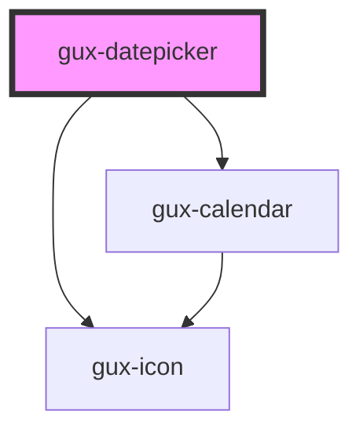

# gux-datepicker

This is a datepicker component, that allows the user to select a date, or a range of date, depending on the component's `mode`.

<!-- Auto Generated Below -->

## Properties

| Property         | Attribute          | Description                                                                                          | Type                                          | Default                |
| ---------------- | ------------------ | ---------------------------------------------------------------------------------------------------- | --------------------------------------------- | ---------------------- |
| `disabled`       | `disabled`         | Disable the input and prevent interactions.                                                          | `boolean`                                     | `false`                |
| `format`         | `format`           | The datepicker date format (default to mm/dd/yyyy, or specified)                                     | `string`                                      | `'mm/dd/yyyy'`         |
| `label`          | `label`            | The datepicker label (can be a single label, or two separated by a comma if it's a range datepicker) | `string`                                      | `''`                   |
| `maxDate`        | `max-date`         | The max date selectable                                                                              | `string`                                      | `''`                   |
| `minDate`        | `min-date`         | The min date selectable                                                                              | `string`                                      | `''`                   |
| `mode`           | `mode`             | The calendar mode (can be single or range)                                                           | `CalendarModes.Range \| CalendarModes.Single` | `CalendarModes.Single` |
| `numberOfMonths` | `number-of-months` | The datepicker number of months displayed                                                            | `number`                                      | `1`                    |
| `value`          | `value`            | The datepicker current value                                                                         | `string`                                      | `undefined`            |

## Events

| Event   | Description                        | Type                  |
| ------- | ---------------------------------- | --------------------- |
| `input` | Triggered when user selects a date | `CustomEvent<string>` |

## Dependencies

### Depends on

- [gux-icon](../gux-icon)
- [gux-calendar](../gux-calendar)

### Graph

----------------------------------------------

*Built with [StencilJS](https://stenciljs.com/)*
