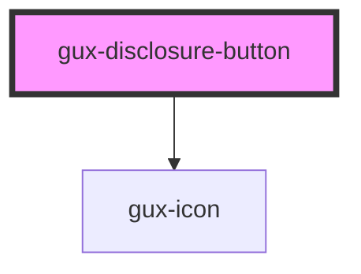

# gux-disclosure-button

This is a UI button component that is used to open or dismiss an associated panel.

<!-- Auto Generated Below -->

## Properties

| Property   | Attribute  | Description                                   | Type                | Default  |
| ---------- | ---------- | --------------------------------------------- | ------------------- | -------- |
| `isOpen`   | `is-open`  | Used to open or close the disclosure panel    | `boolean`           | `false`  |
| `label`    | `label`    | Indicates the label for the disclosure button | `string`            | `'open'` |
| `position` | `position` | Indicates the position of the button panel    | `"left" \| "right"` | `'left'` |

## Events

| Event    | Description                                              | Type               |
| -------- | -------------------------------------------------------- | ------------------ |
| `active` | Return the state of the components panel on state change | `CustomEvent<any>` |

## Dependencies

### Depends on

- [gux-icon](../gux-icon)

### Graph

----------------------------------------------

*Built with [StencilJS](https://stenciljs.com/)*
