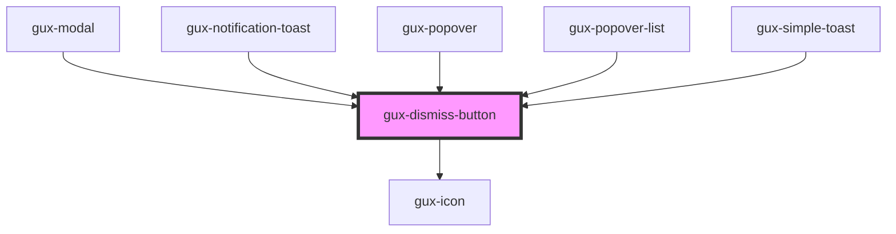

# gux-dismiss-button

This component is meant for use in other components as a dismiss button.

<!-- Auto Generated Below -->

## Dependencies

### Used by

 - [gux-modal](../gux-modal)
 - [gux-notification-toast](../gux-notification-toast)
 - [gux-popover](../gux-popover)
 - [gux-popover-list](../../beta/gux-popover-list)
 - [gux-simple-toast](../gux-simple-toast)

### Depends on

- [gux-icon](../gux-icon)

### Graph

----------------------------------------------

*Built with [StencilJS](https://stenciljs.com/)*
