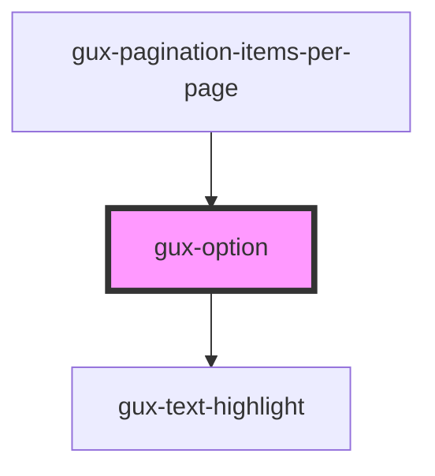

# gux-option

<!-- Auto Generated Below -->

## Properties

| Property   | Attribute  | Description                                                                                                                                                                                                          | Type      | Default     |
| ---------- | ---------- | -------------------------------------------------------------------------------------------------------------------------------------------------------------------------------------------------------------------- | --------- | ----------- |
| `disabled` | `disabled` | If this Boolean attribute is set, this option is not checkable. It won't receive any browsing events, like mouse clicks or focus-related ones.                                                                       | `boolean` | `undefined` |
| `text`     | `text`     | The content of this attribute represents the value to be displayed, If this attribute is omitted, the value is taken from the text content of the slot. This attribute takes precedence over slot value              | `string`  | `undefined` |
| `value`    | `value`    | The content of this attribute represents the value to be submitted on 'input' changes, should this option be selected. If this attribute is omitted, the value is taken from the text content of the option element. | `string`  | `undefined` |

## Methods

### `shouldFilter(searchInput: string) => Promise<boolean>`

Determines if the search input matches this option.

#### Returns

Type: `Promise<boolean>`

## Dependencies

### Used by

 - [gux-pagination-items-per-page](../../gux-pagination/gux-pagination-items-per-page)

### Depends on

- [gux-text-highlight](../../gux-text-highlight)

### Graph

----------------------------------------------

*Built with [StencilJS](https://stenciljs.com/)*
