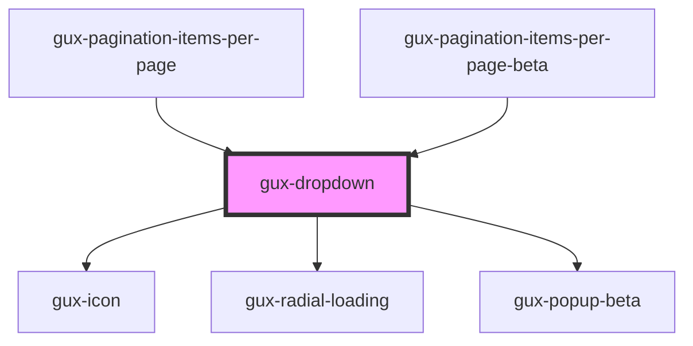

# gux-dropdown

<!-- Auto Generated Below -->

## Properties

| Property      | Attribute     | Description                                                           | Type                                  | Default     |
| ------------- | ------------- | --------------------------------------------------------------------- | ------------------------------------- | ----------- |
| `disabled`    | `disabled`    |                                                                       | `boolean`                             | `false`     |
| `filterType`  | `filter-type` |                                                                       | `"custom" \| "none" \| "starts-with"` | `'none'`    |
| `filterable`  | `filterable`  | deprecated will be removed in v4 (COMUI-1369). Use filterType instead | `boolean`                             | `false`     |
| `hasError`    | `has-error`   |                                                                       | `boolean`                             | `false`     |
| `loading`     | `loading`     |                                                                       | `boolean`                             | `false`     |
| `placeholder` | `placeholder` |                                                                       | `string`                              | `undefined` |
| `required`    | `required`    |                                                                       | `boolean`                             | `false`     |
| `value`       | `value`       |                                                                       | `string`                              | `undefined` |

## Events

| Event          | Description | Type                  |
| -------------- | ----------- | --------------------- |
| `guxcollapsed` |             | `CustomEvent<void>`   |
| `guxexpanded`  |             | `CustomEvent<void>`   |
| `guxfilter`    |             | `CustomEvent<string>` |

## Slots

| Slot | Description                                      |
| ---- | ------------------------------------------------ |
|      | for a gux-listbox containing gux-option children |

## Dependencies

### Used by

 - [gux-pagination-items-per-page](../gux-pagination/gux-pagination-items-per-page)
 - [gux-pagination-items-per-page-beta](../../beta/gux-pagination-beta/gux-pagination-items-per-page-beta)

### Depends on

- [gux-icon](../gux-icon)
- [gux-radial-loading](../gux-radial-loading)
- [gux-popup-beta](../../beta/gux-popup-beta)

### Graph

----------------------------------------------

*Built with [StencilJS](https://stenciljs.com/)*
