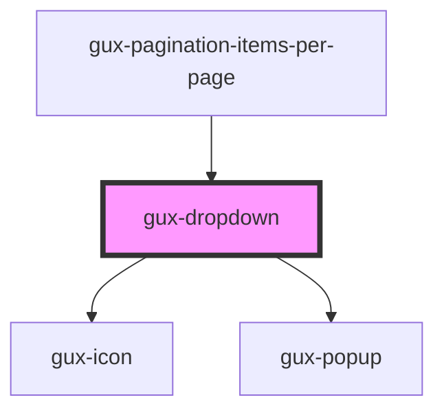

# gux-dropdown

<!-- Auto Generated Below -->

## Properties

| Property      | Attribute     | Description | Type      | Default     |
| ------------- | ------------- | ----------- | --------- | ----------- |
| `disabled`    | `disabled`    |             | `boolean` | `false`     |
| `filterable`  | `filterable`  |             | `boolean` | `false`     |
| `placeholder` | `placeholder` |             | `string`  | `undefined` |
| `value`       | `value`       |             | `string`  | `undefined` |

## Slots

| Slot | Description      |
| ---- | ---------------- |
|      | for gux-list-box |

## Dependencies

### Used by

 - [gux-pagination-items-per-page](../gux-pagination/gux-pagination-items-per-page)

### Depends on

- [gux-icon](../gux-icon)
- [gux-popup](../gux-popup)

### Graph

----------------------------------------------

*Built with [StencilJS](https://stenciljs.com/)*
