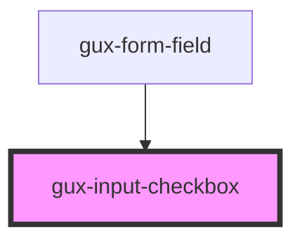

# gux-input-checkbox

<!-- Auto Generated Below -->

## Properties

| Property   | Attribute   | Description | Type      | Default     |
| ---------- | ----------- | ----------- | --------- | ----------- |
| `hasError` | `has-error` |             | `boolean` | `undefined` |

## Slots

| Slot      | Description                              |
| --------- | ---------------------------------------- |
| `"input"` | Required slot for input[type="checkbox"] |
| `"label"` | Required slot for label                  |

## Dependencies

### Used by

 - [gux-form-field](../..)

### Graph

----------------------------------------------

*Built with [StencilJS](https://stenciljs.com/)*
