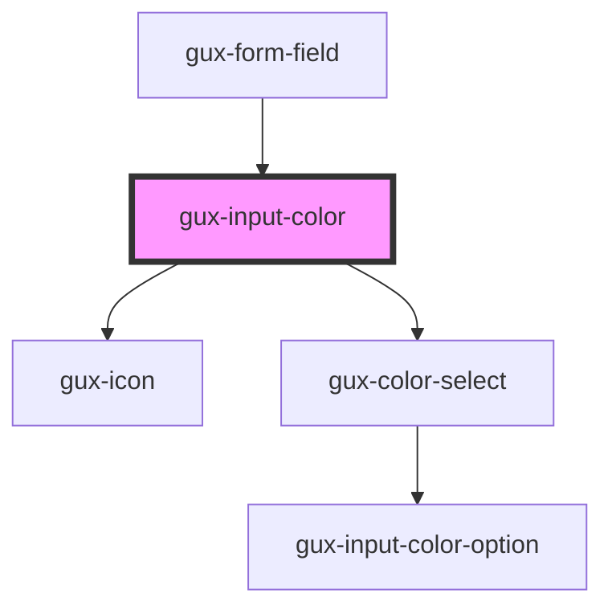

# gux-input-color

<!-- Auto Generated Below -->

## Properties

| Property      | Attribute      | Description | Type      | Default     |
| ------------- | -------------- | ----------- | --------- | ----------- |
| `guxErrorId`  | `gux-error-id` |             | `string`  | `undefined` |
| `guxLabelId`  | `gux-label-id` |             | `string`  | `undefined` |
| `guxRequired` | `gux-required` |             | `boolean` | `undefined` |

## Slots

| Slot      | Description                           |
| --------- | ------------------------------------- |
| `"input"` | Required slot for input[type="color"] |

## Dependencies

### Used by

 - [gux-form-field](../..)

### Depends on

- [gux-icon](../../../gux-icon)
- [gux-color-select](./components/gux-color-select)

### Graph

----------------------------------------------

*Built with [StencilJS](https://stenciljs.com/)*
