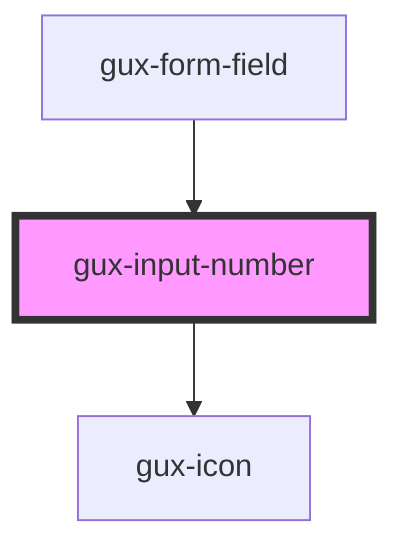

# gux-text-field-legacy

This component is an html input component having update indicator or error/warning message on it.
You can specify a validation function to add this test on input. You can do it by yourself using the input event and
changing error-message attribute.

## Example usage

``` html
<gux-text-field-legacy>
</gux-text-field-legacy>
```

<!-- Auto Generated Below -->


## Properties

| Property    | Attribute   | Description | Type      | Default     |
| ----------- | ----------- | ----------- | --------- | ----------- |
| `clearable` | `clearable` |             | `boolean` | `undefined` |


## Slots

| Slot      | Description                           |
| --------- | ------------------------------------- |
| `"input"` | Required slot for input[type="radio"] |
| `"label"` | Required slot for label               |


## Dependencies

### Used by

 - [gux-form-field](../..)

### Depends on

- [gux-icon](../../../gux-icon)

### Graph


----------------------------------------------

*Built with [StencilJS](https://stenciljs.com/)*
