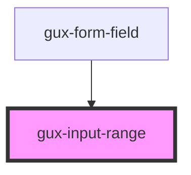

# gux-range

<!-- Auto Generated Below -->

## Properties

| Property         | Attribute          | Description | Type      | Default     |
| ---------------- | ------------------ | ----------- | --------- | ----------- |
| `displayUnits`   | `display-units`    |             | `string`  | `undefined` |
| `valueInTooltip` | `value-in-tooltip` |             | `boolean` | `false`     |

## Slots

| Slot      | Description                           |
| --------- | ------------------------------------- |
| `"input"` | Required slot for input[type="range"] |
| `"label"` | Required slot for label               |

## Dependencies

### Used by

 - [gux-form-field](../..)

### Graph

----------------------------------------------

*Built with [StencilJS](https://stenciljs.com/)*
