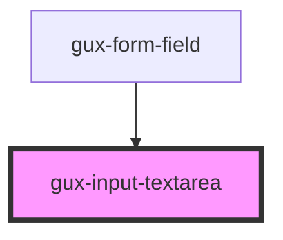

# gux-input-textarea

<!-- Auto Generated Below -->

## Properties

| Property | Attribute | Description | Type                           | Default  |
| -------- | --------- | ----------- | ------------------------------ | -------- |
| `resize` | `resize`  |             | `"auto" \| "manual" \| "none"` | `'none'` |

## Slots

| Slot      | Description                |
| --------- | -------------------------- |
| `"input"` | Required slot for textarea |

## Dependencies

### Used by

 - [gux-form-field](../..)

### Graph

----------------------------------------------

*Built with [StencilJS](https://stenciljs.com/)*
