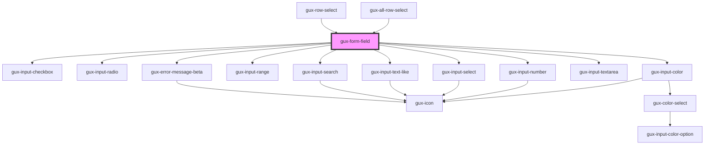

# gux-input

<!-- Auto Generated Below -->

## Properties

| Property         | Attribute          | Description | Type                           | Default     |
| ---------------- | ------------------ | ----------- | ------------------------------ | ----------- |
| `clearable`      | `clearable`        |             | `boolean`                      | `undefined` |
| `displayUnits`   | `display-units`    |             | `string`                       | `undefined` |
| `resize`         | `resize`           |             | `"auto" \| "manual" \| "none"` | `undefined` |
| `valueInTooltip` | `value-in-tooltip` |             | `boolean`                      | `undefined` |

## Slots

| Slot      | Description                 |
| --------- | --------------------------- |
| `"input"` | Required slot for input tag |
| `"label"` | Required slot for label tag |

## Dependencies

### Used by

 - [gux-all-row-select](../../beta/gux-table/gux-all-row-select)
 - [gux-row-select](../../beta/gux-table/gux-row-select)

### Depends on

- [gux-input-checkbox](./components/gux-input-checkbox)
- [gux-input-radio](./components/gux-input-radio)
- [gux-input-color](./components/gux-input-color)
- [gux-input-range](./components/gux-input-range)
- [gux-input-number](./components/gux-input-number)
- [gux-input-select](./components/gux-input-select)
- [gux-input-text-like](./components/gux-input-text-like)
- [gux-input-search](./components/gux-input-search)
- [gux-input-textarea](./components/gux-input-textarea)
- [gux-error-message-beta](../../beta/gux-error-message-beta)

### Graph

----------------------------------------------

*Built with [StencilJS](https://stenciljs.com/)*
