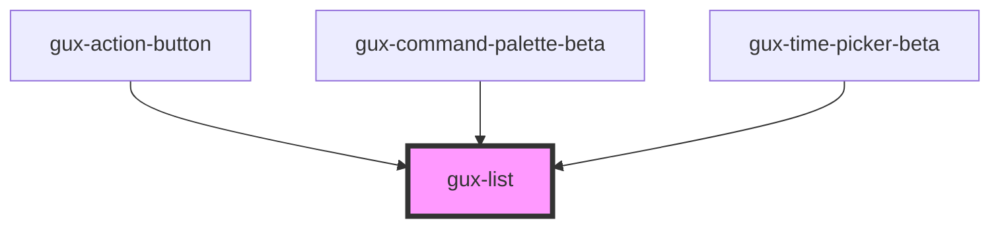

# gux-list

A list element. In order to use this element list contents must be slotted in.

Example usage

```html
<gux-list>
  <gux-list-item value="test" text="test1" />
  <gux-list-divider />
  <gux-list-item value="test" text="test2" />
  <gux-list-item value="test" text="test3" />
</gux-list>
```

Example with slotting

```html
<gux-list>
  <gux-list-item
    ><span>⌘</span><gux-text-highlight text="test"
  /></gux-list-item>
</gux-list>
```

<!-- Auto Generated Below -->


## Properties

| Property    | Attribute   | Description                        | Type     | Default     |
| ----------- | ----------- | ---------------------------------- | -------- | ----------- |
| `highlight` | `highlight` | The highlight value                | `string` | `undefined` |
| `value`     | `value`     | The current selection in the list. | `any`    | `undefined` |


## Events

| Event     | Description                                     | Type               |
| --------- | ----------------------------------------------- | ------------------ |
| `changed` | Triggered when the list's selection is changed. | `CustomEvent<any>` |


## Methods

### `isFirstItemSelected() => Promise<boolean>`

Returns whether the first item in the list is selected.

#### Returns

Type: `Promise<boolean>`


### `isLastItemSelected() => Promise<boolean>`

Returns whether the last item in the list is selected.

#### Returns

Type: `Promise<boolean>`


### `setFocusOnFirstItem() => Promise<void>`


#### Returns

Type: `Promise<void>`


### `setFocusOnLastItem() => Promise<void>`


#### Returns

Type: `Promise<void>`


## Dependencies

### Used by

 - [gux-action-button](../gux-action-button)
 - [gux-command-palette-beta](../../beta/gux-command-palette)
 - [gux-time-picker-beta](../../beta/gux-time-picker)

### Graph


----------------------------------------------

*Built with [StencilJS](https://stenciljs.com/)*
