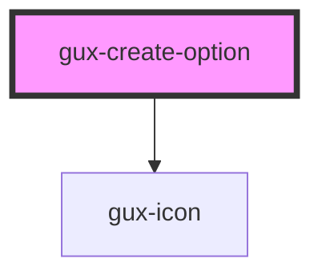

# gux-create-option

<!-- Auto Generated Below -->

## Properties

| Property   | Attribute  | Description | Type      | Default     |
| ---------- | ---------- | ----------- | --------- | ----------- |
| `active`   | `active`   |             | `boolean` | `false`     |
| `filtered` | `filtered` |             | `boolean` | `true`      |
| `hidden`   | `hidden`   |             | `boolean` | `true`      |
| `value`    | `value`    |             | `string`  | `undefined` |

## Events

| Event                     | Description | Type                  |
| ------------------------- | ----------- | --------------------- |
| `internalcreatenewoption` |             | `CustomEvent<string>` |

## Methods

### `guxEmitInternalCreateNewOption() => Promise<void>`

#### Returns

Type: `Promise<void>`

## Dependencies

### Depends on

- [gux-icon](../../gux-icon)

### Graph

----------------------------------------------

*Built with [StencilJS](https://stenciljs.com/)*
