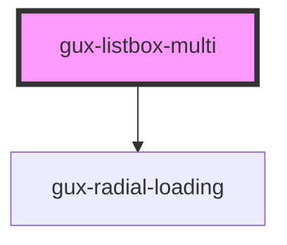

# gux-listbox-multi

<!-- Auto Generated Below -->

## Properties

| Property        | Attribute         | Description | Type      | Default     |
| --------------- | ----------------- | ----------- | --------- | ----------- |
| `filter`        | `filter`          |             | `string`  | `''`        |
| `hasExactMatch` | `has-exact-match` |             | `boolean` | `false`     |
| `loading`       | `loading`         |             | `boolean` | `false`     |
| `textInput`     | `text-input`      |             | `string`  | `''`        |
| `value`         | `value`           |             | `string`  | `undefined` |

## Events

| Event                           | Description | Type               |
| ------------------------------- | ----------- | ------------------ |
| `internallistboxoptionsupdated` |             | `CustomEvent<any>` |

## Methods

### `guxSelectActive() => Promise<void>`

#### Returns

Type: `Promise<void>`

## Slots

| Slot | Description                             |
| ---- | --------------------------------------- |
|      | collection of gux-option-multi elements |

## Dependencies

### Depends on

- [gux-radial-loading](../gux-radial-loading)

### Graph

----------------------------------------------

*Built with [StencilJS](https://stenciljs.com/)*
