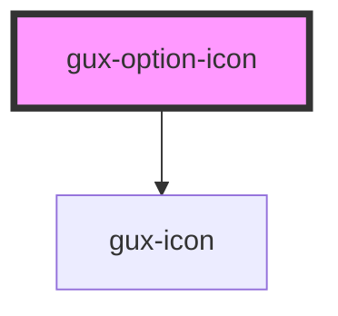

# gux-option-icon

<!-- Auto Generated Below -->

## Properties

| Property    | Attribute    | Description | Type      | Default     |
| ----------- | ------------ | ----------- | --------- | ----------- |
| `active`    | `active`     |             | `boolean` | `false`     |
| `disabled`  | `disabled`   |             | `boolean` | `false`     |
| `filtered`  | `filtered`   |             | `boolean` | `false`     |
| `hovered`   | `hovered`    |             | `boolean` | `false`     |
| `iconColor` | `icon-color` |             | `string`  | `undefined` |
| `iconName`  | `icon-name`  |             | `string`  | `undefined` |
| `selected`  | `selected`   |             | `boolean` | `false`     |
| `value`     | `value`      |             | `string`  | `undefined` |

## Slots

| Slot | Description |
| ---- | ----------- |
|      | text        |

## Dependencies

### Depends on

- [gux-icon](../../../gux-icon)

### Graph

----------------------------------------------

*Built with [StencilJS](https://stenciljs.com/)*
