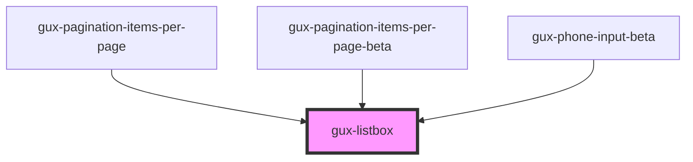

# gux-listbox

<!-- Auto Generated Below -->

## Properties

| Property | Attribute | Description | Type     | Default     |
| -------- | --------- | ----------- | -------- | ----------- |
| `filter` | `filter`  |             | `string` | `''`        |
| `value`  | `value`   |             | `string` | `undefined` |

## Events

| Event                           | Description | Type               |
| ------------------------------- | ----------- | ------------------ |
| `internallistboxoptionsupdated` |             | `CustomEvent<any>` |

## Methods

### `guxSelectActive() => Promise<void>`

#### Returns

Type: `Promise<void>`

## Slots

| Slot | Description                       |
| ---- | --------------------------------- |
|      | collection of gux-option elements |

## Dependencies

### Used by

 - [gux-pagination-items-per-page](../gux-pagination/gux-pagination-items-per-page)
 - [gux-pagination-items-per-page-beta](../../beta/gux-pagination-beta/gux-pagination-items-per-page-beta)
 - [gux-phone-input-beta](../../beta/gux-phone-input)

### Graph

----------------------------------------------

*Built with [StencilJS](https://stenciljs.com/)*
