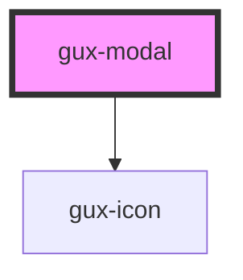

# genesys-modal

This default behaviour of this componet assumes that `gux-modal` components will be added to the DOM when they are need and then removed from the DOM after the user interacts with them. For this reason the default behaviour of the guxdismiss event is to remove the element from the DOM. The removal of the element from the DOM should be implemented by client apps on the clicking of all buttons too. If you want your app to not add and remove a new `gux-modal` component for each interaction you can override the default behaviour by listening for the `guxdismiss` custom event and preventing the default behaviour which removes the component from the DOM.

<!-- Auto Generated Below -->

## Properties

| Property | Attribute | Description                                              | Type                                          | Default     |
| -------- | --------- | -------------------------------------------------------- | --------------------------------------------- | ----------- |
| `size`   | `size`    | Indicates the size of the modal (small, medium or large) | `"dynamic" \| "large" \| "medium" \| "small"` | `'dynamic'` |

## Events

| Event        | Description                                                                                           | Type                |
| ------------ | ----------------------------------------------------------------------------------------------------- | ------------------- |
| `guxdismiss` | Fired when a user dismisses the modal (The default behaviour is to remove the component from the DOM) | `CustomEvent<void>` |

## Slots

| Slot                    | Description                                                       |
| ----------------------- | ----------------------------------------------------------------- |
| `"content"`             | Required slot for the modal content                               |
| `"left-align-buttons"`  | Optional slot to set gux-buttons aligned to the left of the modal |
| `"right-align-buttons"` | Optional slot to set gux-buttons aligned to the left of the modal |
| `"title"`               | Optional slot to set the modal title                              |

## Dependencies

### Depends on

- [gux-icon](../gux-icon)

### Graph

----------------------------------------------

*Built with [StencilJS](https://stenciljs.com/)*
