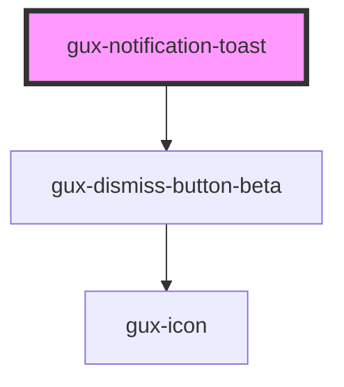

# gux-notification-toast

<!-- Auto Generated Below -->

## Properties

| Property | Attribute | Description           | Type                                              | Default     |
| -------- | --------- | --------------------- | ------------------------------------------------- | ----------- |
| `accent` | `accent`  | The component accent. | `"alert" \| "neutral" \| "positive" \| "warning"` | `'neutral'` |

## Events

| Event        | Description | Type                |
| ------------ | ----------- | ------------------- |
| `guxdismiss` |             | `CustomEvent<void>` |

## Slots

| Slot        | Description                                      |
| ----------- | ------------------------------------------------ |
| `"icon"`    | Required slot for gux-icon                       |
| `"message"` | Required slot for the notification toast message |
| `"title"`   | Required slot for the notification toast title   |

## Dependencies

### Depends on

- [gux-dismiss-button-beta](../../beta/gux-dismiss-button)

### Graph

----------------------------------------------

*Built with [StencilJS](https://stenciljs.com/)*
