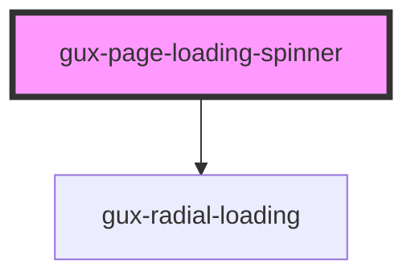

# gux-page-loading-spinner

A simple loading spinner for loading pages.

<!-- Auto Generated Below -->

## Properties

| Property           | Attribute           | Description                                                                         | Type     | Default |
| ------------------ | ------------------- | ----------------------------------------------------------------------------------- | -------- | ------- |
| `screenreaderText` | `screenreader-text` | Required localized text to provide screen reader accessible label for the component | `string` | `''`    |

## Dependencies

### Depends on

- [gux-radial-loading](../gux-radial-loading)

### Graph

----------------------------------------------

*Built with [StencilJS](https://stenciljs.com/)*
