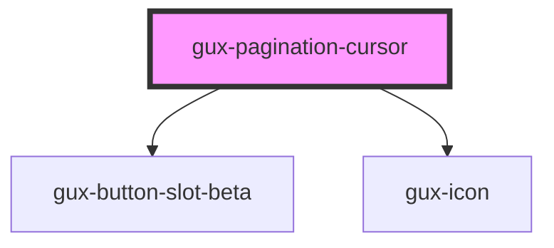

# gux-pagination-cursor

<!-- Auto Generated Below -->

## Properties

| Property      | Attribute      | Description | Type      | Default |
| ------------- | -------------- | ----------- | --------- | ------- |
| `hasNext`     | `has-next`     |             | `boolean` | `false` |
| `hasPrevious` | `has-previous` |             | `boolean` | `false` |

## Events

| Event                       | Description | Type                                |
| --------------------------- | ----------- | ----------------------------------- |
| `guxPaginationCursorchange` |             | `CustomEvent<"next" \| "previous">` |

## Dependencies

### Depends on

- [gux-button-slot-beta](../../beta/gux-button-slot)
- [gux-icon](../gux-icon)

### Graph

----------------------------------------------

*Built with [StencilJS](https://stenciljs.com/)*
