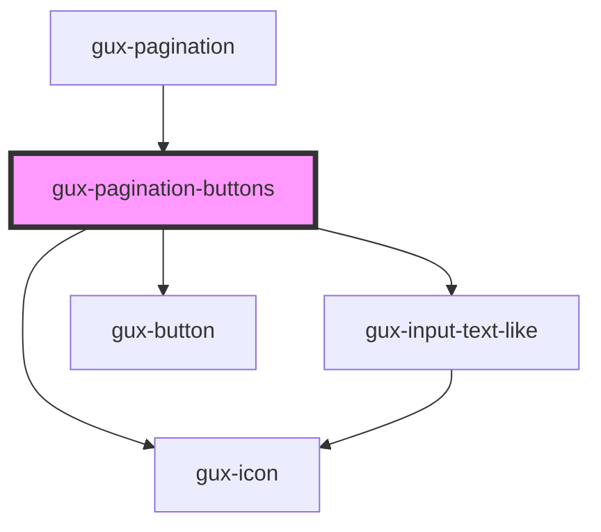

# gux-pagination-buttons

An internal component used by the gux-pagination component.

<!-- Auto Generated Below -->

## Properties

| Property      | Attribute      | Description | Type                              | Default     |
| ------------- | -------------- | ----------- | --------------------------------- | ----------- |
| `currentPage` | `current-page` |             | `number`                          | `undefined` |
| `layout`      | `layout`       |             | `"expanded" \| "full" \| "small"` | `'full'`    |
| `totalPages`  | `total-pages`  |             | `number`                          | `undefined` |

## Events

| Event                       | Description | Type                  |
| --------------------------- | ----------- | --------------------- |
| `internalcurrentpagechange` |             | `CustomEvent<number>` |

## Dependencies

### Used by

 - [gux-pagination](..)

### Depends on

- [gux-input-text-like](../../gux-form-field/components/gux-input-text-like)
- [gux-button](../../gux-button)
- [gux-icon](../../gux-icon)

### Graph

----------------------------------------------

*Built with [StencilJS](https://stenciljs.com/)*
