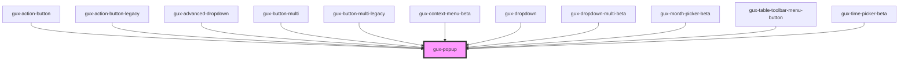

# gux-input

<!-- Auto Generated Below -->

## Properties

| Property   | Attribute  | Description | Type      | Default |
| ---------- | ---------- | ----------- | --------- | ------- |
| `disabled` | `disabled` |             | `boolean` | `false` |
| `expanded` | `expanded` |             | `boolean` | `false` |

## Events

| Event               | Description                                                          | Type                |
| ------------------- | -------------------------------------------------------------------- | ------------------- |
| `internalcollapsed` | This event will run when the popup transitions to a collapsed state. | `CustomEvent<void>` |
| `internalexpanded`  | This event will run when the popup transitions to an expanded state. | `CustomEvent<void>` |

## Slots

| Slot       | Description              |
| ---------- | ------------------------ |
| `"popup"`  | Required slot for popup  |
| `"target"` | Required slot for target |

## Dependencies

### Used by

 - [gux-action-button](../gux-action-button)
 - [gux-action-button-legacy](../../legacy/gux-action-button-legacy)
 - [gux-advanced-dropdown](../gux-advanced-dropdown)
 - [gux-button-multi](../gux-button-multi)
 - [gux-button-multi-legacy](../../legacy/gux-button-multi-legacy)
 - [gux-context-menu-beta](../../beta/gux-context-menu)
 - [gux-dropdown](../gux-dropdown)
 - [gux-dropdown-multi-beta](../../beta/gux-dropdown-multi)
 - [gux-month-picker-beta](../../beta/gux-month-picker)
 - [gux-table-toolbar-menu-button](../../beta/gux-table-toolbar/gux-table-toolbar-menu-button)
 - [gux-time-picker-beta](../../beta/gux-time-picker)

### Graph

----------------------------------------------

*Built with [StencilJS](https://stenciljs.com/)*
