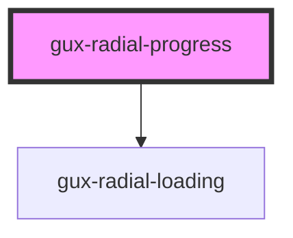

# gux-radial-progress

When the progress of a task is known, this component displays a radial indicator and the completed percentage of 
the task.

Otherwise, if the progress is unknown, and no percentage is provided, it instead displays a simple Loading Spinner.

<!-- Auto Generated Below -->

## Properties

| Property | Attribute | Description                                                         | Type     | Default     |
| -------- | --------- | ------------------------------------------------------------------- | -------- | ----------- |
| `max`    | `max`     | The max value of the progress spinner                               | `number` | `100`       |
| `value`  | `value`   | The progress made in the progress spinner compared to the max value | `number` | `undefined` |

## Dependencies

### Depends on

- [gux-radial-loading](../gux-radial-loading)

### Graph

----------------------------------------------

*Built with [StencilJS](https://stenciljs.com/)*
