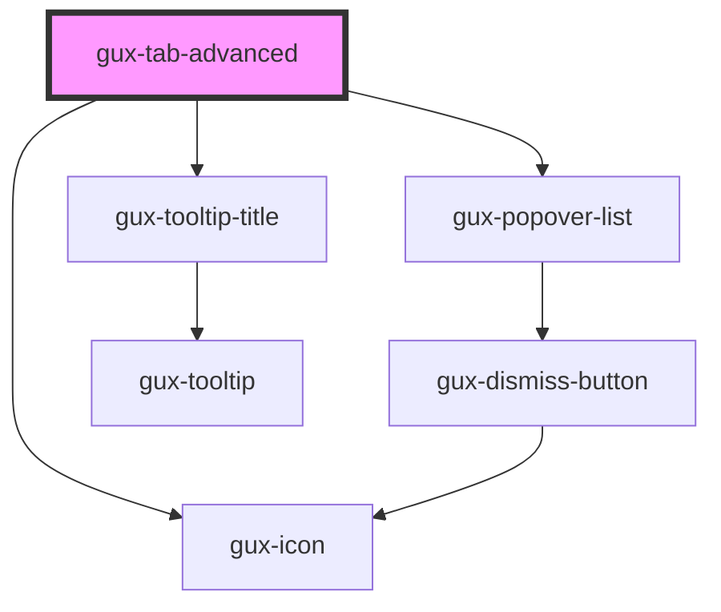

# gux-tab-advanced

<!-- Auto Generated Below -->

## Properties

| Property      | Attribute       | Description                                                                                         | Type      | Default     |
| ------------- | --------------- | --------------------------------------------------------------------------------------------------- | --------- | ----------- |
| `guxDisabled` | `gux-disabled`  |                                                                                                     | `boolean` | `false`     |
| `tabIconName` | `tab-icon-name` | indicates the gux-icon to display on the left side of the tab (similar to a favicon in the browser) | `string`  | `undefined` |
| `tabId`       | `tab-id`        | unique id for the tab                                                                               | `string`  | `undefined` |

## Events

| Event                      | Description | Type                  |
| -------------------------- | ----------- | --------------------- |
| `internalactivatetabpanel` |             | `CustomEvent<string>` |

## Methods

### `guxFocus() => Promise<void>`

#### Returns

Type: `Promise<void>`

### `guxGetActive() => Promise<boolean>`

#### Returns

Type: `Promise<boolean>`

### `guxSetActive(active: boolean) => Promise<void>`

#### Returns

Type: `Promise<void>`

## Dependencies

### Depends on

- [gux-icon](../../gux-icon)
- [gux-popover-list](../../../beta/gux-popover-list)
- [gux-tooltip-title](../../gux-tooltip-title)

### Graph

----------------------------------------------

*Built with [StencilJS](https://stenciljs.com/)*
