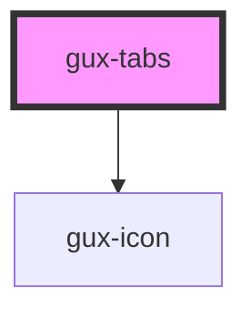

# gux-tabs

<!-- Auto Generated Below -->

## Properties

| Property           | Attribute             | Description                         | Type      | Default |
| ------------------ | --------------------- | ----------------------------------- | --------- | ------- |
| `allowSort`        | `allow-sort`          | Enable tab sorting by drag/drop     | `boolean` | `false` |
| `showNewTabButton` | `show-new-tab-button` | Enable new tab button               | `boolean` | `false` |
| `value`            | `value`               | tabId of the currently selected tab | `string`  | `''`    |

## Events

| Event         | Description                                       | Type                    |
| ------------- | ------------------------------------------------- | ----------------------- |
| `input`       | Triggers when a tab is selected.                  | `CustomEvent<any>`      |
| `newTab`      | Triggers when the new tab button is selected.     | `CustomEvent<any>`      |
| `sortChanged` | Triggers when the sorting of the tabs is changed. | `CustomEvent<string[]>` |

## Dependencies

### Depends on

- [gux-icon](../gux-icon)

### Graph

----------------------------------------------

*Built with [StencilJS](https://stenciljs.com/)*
