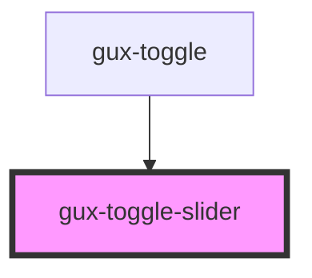

# gux-toggle-slider

<!-- Auto Generated Below -->

## Properties

| Property  | Attribute | Description | Type      | Default     |
| --------- | --------- | ----------- | --------- | ----------- |
| `checked` | `checked` |             | `boolean` | `undefined` |

## Dependencies

### Used by

 - [gux-toggle](..)

### Graph

----------------------------------------------

*Built with [StencilJS](https://stenciljs.com/)*
