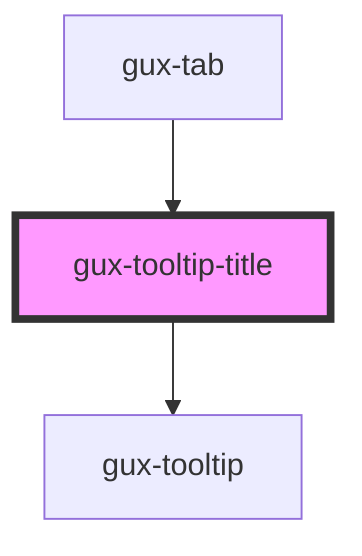

# gux-title-tooltip

<!-- Auto Generated Below -->

## Properties

| Property   | Attribute   | Description | Type     | Default     |
| ---------- | ----------- | ----------- | -------- | ----------- |
| `tabWidth` | `tab-width` |             | `number` | `undefined` |

## Dependencies

### Used by

 - [gux-tab](../gux-tabs/gux-tab)

### Depends on

- [gux-tooltip](../gux-tooltip)

### Graph

----------------------------------------------

*Built with [StencilJS](https://stenciljs.com/)*
