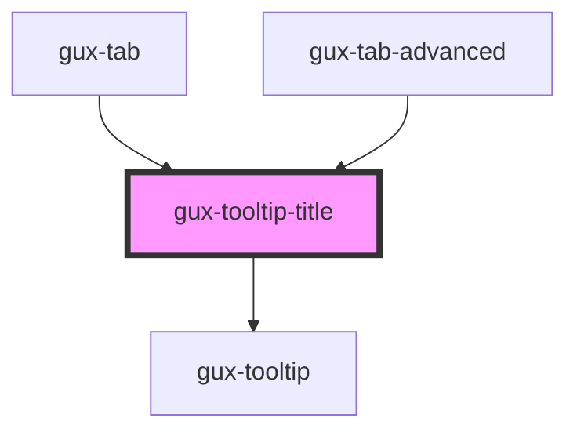

# gux-title-tooltip

<!-- Auto Generated Below -->

## Methods

### `setHideTooltip() => Promise<void>`

#### Returns

Type: `Promise<void>`

### `setShowTooltip() => Promise<void>`

#### Returns

Type: `Promise<void>`

## Dependencies

### Used by

 - [gux-tab](../gux-tabs/gux-tab)
 - [gux-tab-advanced](../gux-tabs-advanced/gux-tab-advanced)

### Depends on

- [gux-tooltip](../gux-tooltip)

### Graph

----------------------------------------------

*Built with [StencilJS](https://stenciljs.com/)*
