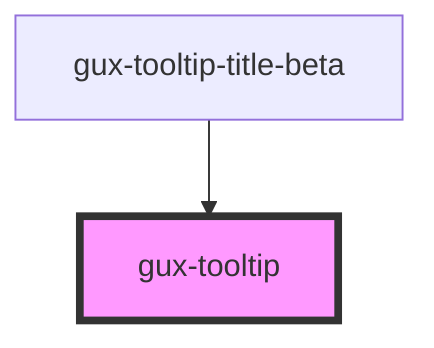

# gux-tooltip

This custom component is a simple tooltip.

When hovering a node, the tooltip will be shown below.

If there is not enough space on the bottom, or right of the component, the tooltip position will be adjusted.

## Example usage

``` html
<!-- First option (With parentElement) -->
<div>
  <button>Button</button>
  <gux-tooltip>My great tooltip</gux-tooltip>
</div>

<!-- Second option (With parent id in for attribute) -->
<button id="needs-tooltip">Button</button>
<gux-tooltip for="needs-tooltip">My great tooltip</gux-tooltip>
```

<!-- Auto Generated Below -->


## Properties

| Property | Attribute | Description                                                                                                | Type     | Default     |
| -------- | --------- | ---------------------------------------------------------------------------------------------------------- | -------- | ----------- |
| `for`    | `for`     | Indicates the id of the element the popover should anchor to. (If not supplied the parent element is used) | `string` | `undefined` |


## Slots

| Slot | Description            |
| ---- | ---------------------- |
|      | Content of the tooltip |


## Dependencies

### Used by

 - [gux-tooltip-title-beta](../../beta/gux-tooltip-title)

### Graph


----------------------------------------------

*Built with [StencilJS](https://stenciljs.com/)*
